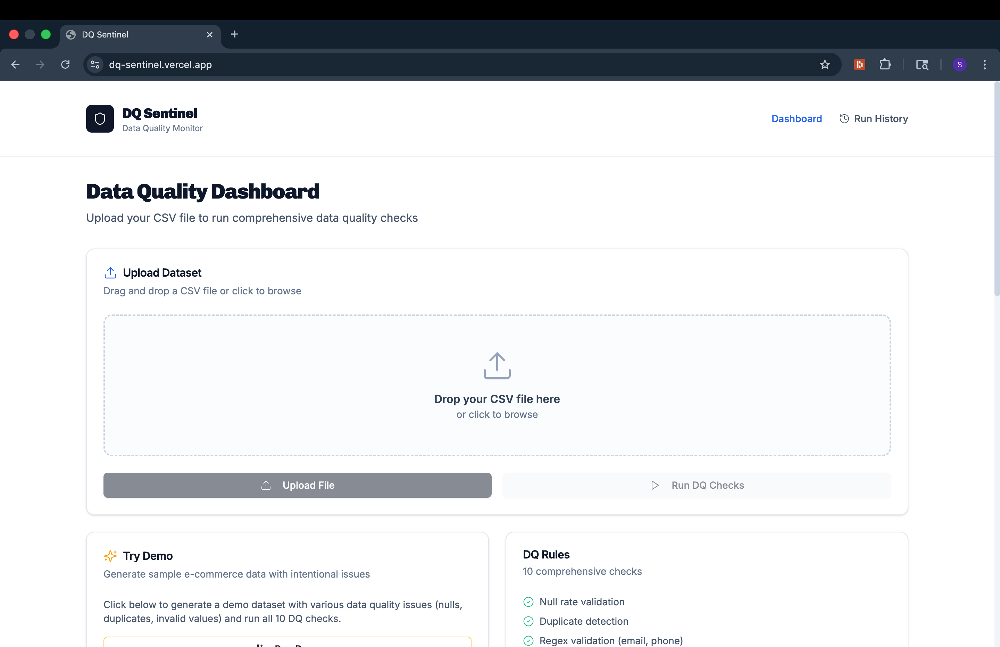
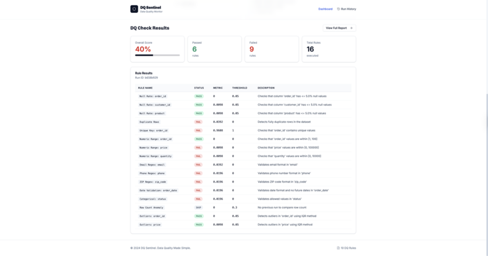
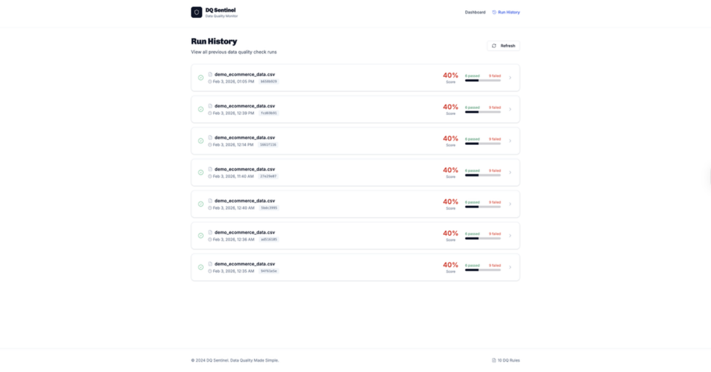

# DQ Sentinel

**Live Demo:** https://dq-sentinel.vercel.app
**Backend API (Render):** https://dq-sentinel-backend.onrender.com/docs
**GitHub Repo:** https://github.com/saiswaroop263/dq-sentinel

DQ Sentinel is a full-stack data quality monitoring app that validates CSV datasets, generates a DQ score + rule-level failures, and tracks run history so teams can catch bad data before it reaches dashboards or ML models.

## Key Highlights
- Built full-stack DQ monitoring app (React + FastAPI + MongoDB) with run history + report export
- Implemented 10 automated DQ rules (nulls, duplicates, regex checks, anomalies, outliers)
- Deployed frontend on Vercel + backend on Render with API docs via Swagger

## Architecture
React (UI) → FastAPI (DQ rules engine) → MongoDB (datasets + runs + results) → JSON/HTML report export

## Screenshots





## What this project shows
- Built an end-to-end DQ system (upload → rules engine → persistence → dashboard)
- Designed rule metrics + thresholds + sample-failure outputs for debugging
- Implemented run history for auditability and trend tracking

## How it Works
1. Upload a CSV (or run Demo Mode)
2. Backend runs 10 DQ rules + generates a DQ report
3. Results are stored in MongoDB (run history)
4. UI shows summary + per-rule failures + downloadable report

## Features

- **CSV Upload**: Drag and drop CSV files for instant data quality analysis
- **10 DQ Rules**: Comprehensive data quality checks including:
  1. Null rate validation (configurable threshold)
  2. Duplicate row detection
  3. Unique key check (ID columns)
  4. Numeric range validation (min/max)
  5. Email regex validation
  6. Phone/ZIP code regex validation
  7. Date parse validation (no invalid/future dates)
  8. Allowed categorical values validation
  9. Row count anomaly detection (±30% vs previous run)
  10. Outlier detection (IQR method)
- **Run History**: Track all previous DQ check runs
- **Reports**: Download detailed reports in JSON or HTML format
- **Demo Mode**: Generate sample e-commerce data with intentional issues

## Tech Stack

- **Frontend**: React 18 + Tailwind CSS + Shadcn UI
- **Backend**: FastAPI (Python 3.11+)
- **Database**: MongoDB


## Environment Variables
Backend:
- MONGO_URL=mongodb://localhost:27017
- DB_NAME=dq_sentinel
- CORS_ORIGINS=*

Frontend:
- REACT_APP_BACKEND_URL=http://localhost:8002

## Project Structure

```
dq-sentinel/
├── backend/
│   ├── server.py          # FastAPI application with DQ rules engine
│   ├── requirements.txt   # Python dependencies
│   └── .env               # Environment variables
├── frontend/
│   ├── src/
│   │   ├── pages/
│   │   │   ├── Dashboard.jsx    # Main upload and demo page
│   │   │   ├── RunHistory.jsx   # List of all DQ runs
│   │   │   └── RunDetails.jsx   # Detailed run results
│   │   ├── App.js              # Main app with routing
│   │   └── index.css           # Global styles
│   └── package.json       # Node.js dependencies
└── README.md
```

## Local Development

### Prerequisites

- Python 3.11+
- Node.js 18 or 20
- MongoDB (local or Docker)

### Start MongoDB with Docker

```bash
docker run -d --name mongodb -p 27017:27017 mongo:latest
```

### Backend Setup

```bash
cd backend

# Create virtual environment
python -m venv venv
source venv/bin/activate  # On Windows: venv\Scripts\activate

# Install dependencies
pip install -r requirements.txt

# Set environment variables
export MONGO_URL="mongodb://localhost:27017"
export DB_NAME="dq_sentinel"
export CORS_ORIGINS="*"

# Start server
uvicorn server:app --host 0.0.0.0 --port 8002 --reload
```

### Frontend Setup

```bash
cd frontend
npm install --legacy-peer-deps
echo "REACT_APP_BACKEND_URL=http://localhost:8002" > .env
npm start

# Set environment variables
echo "REACT_APP_BACKEND_URL=http://localhost:8002" > .env

# Start development server
npm start
```

The frontend will be available at `http://localhost:3000`

## API Endpoints

| Method | Endpoint | Description |
|--------|----------|-------------|
| POST | `/api/upload` | Upload CSV file, returns `dataset_id` |
| POST | `/api/run` | Run DQ checks on dataset, returns `run_id` |
| POST | `/api/demo` | Generate demo data and run checks |
| GET | `/api/runs` | Get all DQ runs |
| GET | `/api/runs/{run_id}` | Get specific run with results |
| GET | `/api/report/{run_id}` | Download JSON report |
| GET | `/api/report/{run_id}/html` | View HTML report |
| GET | `/api/datasets` | Get all uploaded datasets |

## MongoDB Collections

- **datasets**: `dataset_id`, `filename`, `columns`, `row_count`, `sample_rows`, `created_at`
- **runs**: `run_id`, `dataset_id`, `status`, `created_at`, `completed_at`, `summary`, `timings`
- **dq_results**: `run_id`, `rule_name`, `status`, `metric`, `threshold`, `sample_rows`, `description`

### Indexes

```javascript
db.runs.createIndex({ "created_at": -1 })
db.runs.createIndex({ "run_id": 1 })
db.dq_results.createIndex({ "run_id": 1 })
db.datasets.createIndex({ "dataset_id": 1 })
```

## Troubleshooting

### npm install fails
```bash
# Use legacy peer deps flag
npm install --legacy-peer-deps
```

### MongoDB connection refused
```bash
# Check if MongoDB is running
docker ps | grep mongo

# If not running, start it
docker start mongodb
```

### Backend import errors
```bash
# Make sure you're in the virtual environment
source venv/bin/activate

# Reinstall dependencies
pip install -r requirements.txt
```

### CORS errors in browser
```bash
# Make sure CORS_ORIGINS is set correctly in backend/.env
CORS_ORIGINS="*"

# Or specify your frontend URL
CORS_ORIGINS="http://localhost:3000"
```

### Port already in use
```bash
# Find and kill the process using the port
lsof -i :8002  # Backend port
lsof -i :3000  # Frontend port

# Kill the process
kill -9 <PID>
```

## Demo Data

Click the "Run Demo" button to generate a sample e-commerce dataset with intentional data quality issues:

- **Duplicate order IDs**: Orders 5, 10, 15, 20 have duplicate IDs
- **Null values**: Missing customer_id, product, email values
- **Invalid emails**: Malformed email addresses
- **Invalid phone numbers**: Too short or non-numeric values
- **Future dates**: Order dates in the future
- **Negative values**: Negative prices and quantities
- **Invalid status values**: Unknown status values
- **Invalid ZIP codes**: Malformed postal codes
- **Outliers**: Extreme price values

## License

MIT License
